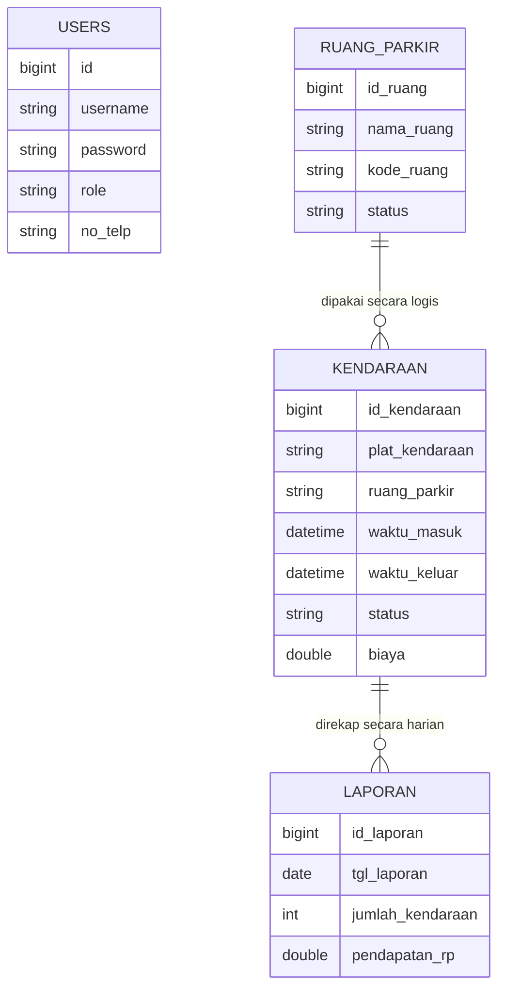
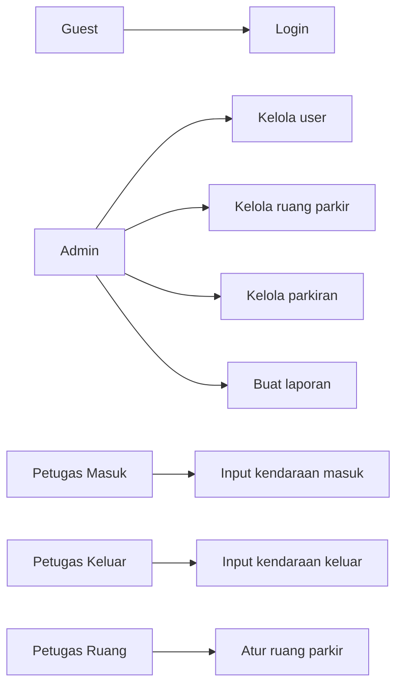
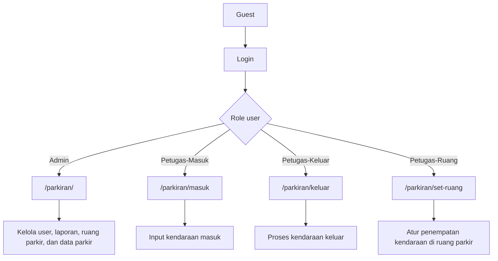

# Dokumentasi Arsitektur Parkiran Web

Dokumen ini merangkum alur pengembangan aplikasi parkiran web, mulai dari entitas database, use case tiap actor, sampai struktur halaman dan endpoint yang dipakai.

## Entitas Database

- `kendaraan.ruang_parkir` menyimpan kode dari `ruang_parkir.kode_ruang`.
- `laporan` dibentuk dari data `kendaraan` yang berstatus `Finished`.

### 1. users

Menyimpan akun login dan role pengguna.

| Field | Tipe | Keterangan |
|---|---|---|
| id | bigint | Primary key |
| username | string | Username login, unik |
| password | string | Password yang sudah di-hash |
| role | string | Admin, Petugas-Masuk, Petugas-Keluar, Petugas-Ruang |
| no_telp | string | Nomor telepon |

### 2. kendaraan

Menyimpan data kendaraan yang masuk dan keluar dari parkiran.

| Field | Tipe | Keterangan |
|---|---|---|
| id_kendaraan | bigint | Primary key |
| plat_kendaraan | string | Nomor plat, unik |
| ruang_parkir | string | Kode ruang parkir yang dipakai |
| waktu_masuk | datetime | Waktu kendaraan masuk |
| waktu_keluar | datetime | Waktu kendaraan keluar |
| status | string | none, Active, Finished |
| biaya | double | Biaya parkir |

### 3. ruang_parkir

Menyimpan daftar slot atau kode ruang parkir.

| Field | Tipe | Keterangan |
|---|---|---|
| id_ruang | bigint | Primary key |
| nama_ruang | string | Nama grup ruang, misalnya lantai atau area |
| kode_ruang | string | Kode slot ruang, unik |
| status | string | kosong / terisi |
| created_at | timestamp | Waktu dibuat |
| updated_at | timestamp | Waktu diperbarui |

### 4. laporan

Menyimpan rekap harian hasil transaksi parkir.

| Field | Tipe | Keterangan |
|---|---|---|
| id_laporan | bigint | Primary key |
| tgl_laporan | date | Tanggal laporan |
| jumlah_kendaraan | integer | Jumlah kendaraan selesai hari itu |
| pendapatan_rp | double | Total pendapatan hari itu |

## Use Case Per Actor

### Guest

- Membuka halaman login.
- Masuk ke sistem dengan username dan password.

### Admin

- Melihat dashboard parkiran.
- Mengelola user.
- Melihat dan membuat laporan harian.
- Mengelola data ruang parkir.
- Melihat data kendaraan masuk dan keluar.

### Petugas Masuk

- Mencatat kendaraan yang masuk.
- Melihat daftar kendaraan aktif terakhir.
- Melihat sisa kapasitas parkir.

### Petugas Keluar

- Mencari kendaraan aktif.
- Memproses kendaraan keluar.
- Menghitung biaya parkir.
- Melepaskan slot ruang parkir yang sebelumnya dipakai.

### Petugas Ruang

- Melihat kendaraan yang belum mendapat ruang.
- Melihat kendaraan yang sudah berada di ruang parkir.
- Menetapkan ruang parkir untuk kendaraan aktif.
- Memperbarui status ruang menjadi kosong atau terisi.

## Diagram Alur Actor

## Struktur Halaman dan Endpoint

Semua halaman utama dilindungi middleware `auth` dan `user-role` sesuai role.

| Halaman | Endpoint | Metode | Akses | Fungsi |
|---|---|---|---|---|
| Login | `/` | GET | Guest | Menampilkan halaman login |
| Login proses | `/login` | POST | Guest | Autentikasi user |
| Logout | `/logout` | POST | Auth | Keluar dari sistem |
| Dashboard parkiran | `/parkiran` | GET | Admin | Tampilan utama admin |
| Data user | `/users` | GET | Admin | Kelola user |
| Laporan | `/laporan` | GET | Admin | Lihat dan buat laporan |
| Ruang parkir | `/ruang-parkir` | GET | Admin | Kelola ruang parkir |
| Data parkiran | `/parkiran` | GET | Admin | Lihat data kendaraan parkir |
| Parkir masuk | `/parkiran/masuk` | GET | Petugas-Masuk | Input kendaraan masuk |
| Parkir keluar | `/parkiran/keluar` | GET | Petugas-Keluar | Proses kendaraan keluar |
| Set ruang | `/parkiran/set-ruang` | GET | Petugas-Ruang | Atur penempatan ruang |

## Struktur Halaman per Layout

### Layout Admin

- `_layouts.base-admin`
- Dipakai oleh halaman admin seperti user, laporan, ruang parkir, dan parkir view.

### Layout Petugas

- `_layouts.base`
- Dipakai oleh halaman parkir masuk, keluar, dan set ruang.

## Catatan Implementasi

- Halaman admin dan petugas dibuat dengan Livewire Component.
- Perubahan data kendaraan memicu event pembaruan agar tampilan lain ikut sinkron.
- Laporan harian dihitung dari kendaraan berstatus `Finished` pada tanggal yang sama.

## Kesimpulan

Struktur sistem ini sederhana: login berdasarkan role, lalu setiap actor masuk ke halaman kerja masing-masing. Data inti ada pada `users`, `kendaraan`, `ruang_parkir`, dan `laporan`, sedangkan endpoint dibagi jelas berdasarkan fungsi admin dan petugas.