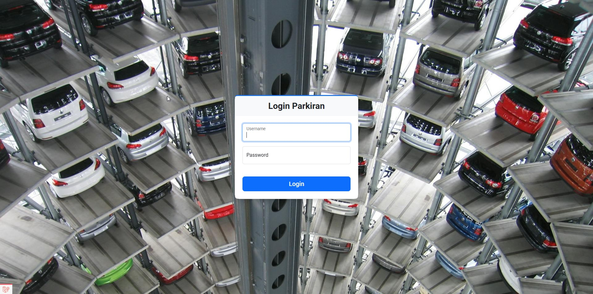
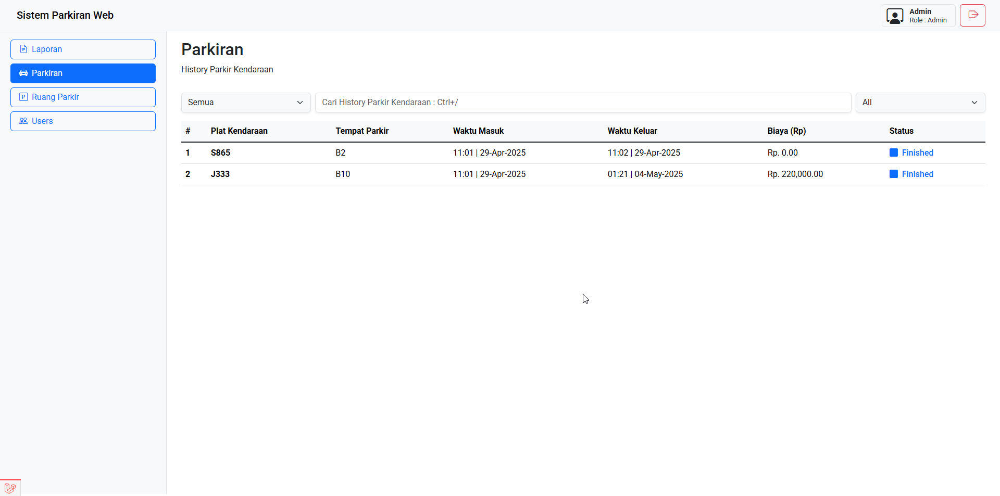
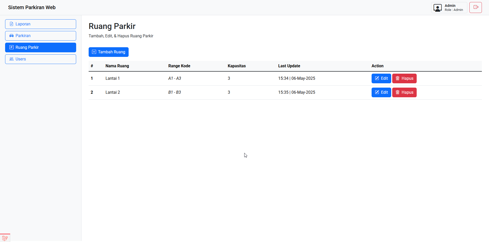
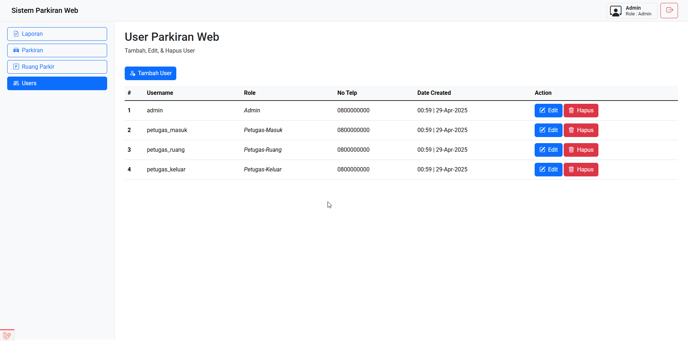
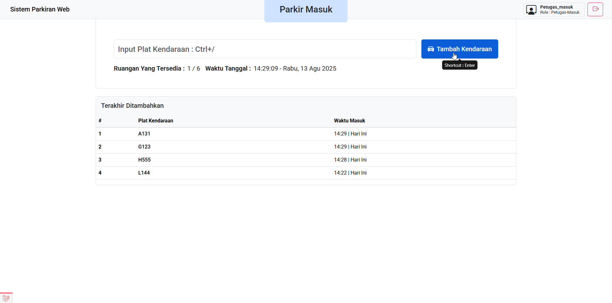
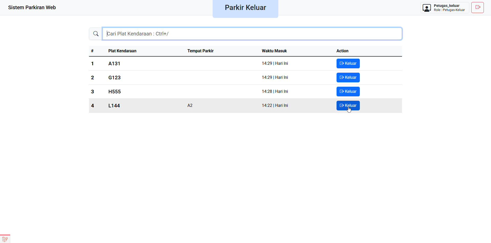
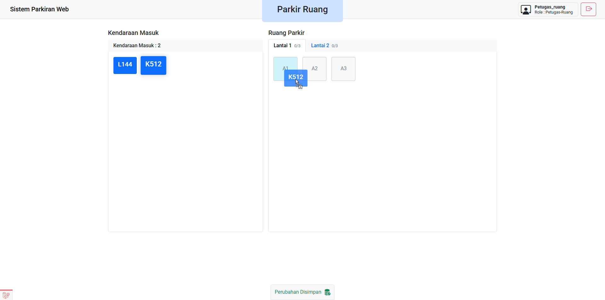

# 🚗 Sistem Parkiran Berbasis Web 
Sistem Parkiran Berbasis Web dengan Laravel Livewire + Bootstrap

## 🛠️ Requirements

- PHP >= 8.1
- Composer
- Node.js & npm
- MySQL atau database lain yang didukung Laravel

## 🚀 Instalasi

1. **Clone repositori ini**

   ```bash
   git clone https://github.com/Jianyao17/Parkiran-Web.git
   cd Parkiran-Web
   ```

2. **Install dependencies PHP**

   ```bash
   composer install
   ```

3. **Copy file environment**

   ```bash
   cp .env.example .env
   ```

4. **Generate application key**

   ```bash
   php artisan key:generate
   ```

5. **Setup database**

   - Buat database baru.
   - Edit `.env` dan sesuaikan pengaturan database:

     ```
     DB_CONNECTION=mysql
     DB_HOST=127.0.0.1
     DB_PORT=3306
     DB_DATABASE=parkiran_web
     DB_USERNAME=root
     DB_PASSWORD=
     ```

6. **Migrasi & Seed database**
   
   Database akan dimigrasi dan Seeder akan membuat user **sementara** di database pada masing-masing role.

   ```bash
   php artisan migrate:fresh --seed
   ```

   ##### 🛠️ Data User yang Dibuat

   | Role             | Username         | Password    |
   |------------------|------------------|-------------|
   | Admin            | admin             | admin123    |
   | Petugas-Masuk    | petugas_masuk     | masuk123    |
   | Petugas-Ruang    | petugas_ruang     | ruang123    |
   | Petugas-Keluar   | petugas_keluar    | keluar123   |

7. **Install dependencies JavaScript**

   ```bash
   npm install
   ```

8. **Build assets**

   ```bash
   npm run build
   ```

      > [!TIP]  
      > Untuk development, gunakan `npm run dev` agar perubahan frontend otomatis ter-update.

9. **Jalankan server lokal**

   ```bash
   php artisan serve
   ```

10. **Akses di browser**

    ```
    http://127.0.0.1:8000
    ```

---

#### 📸 Screenshots

##### Halaman Login


##### Dashboard Admin - Parkiran


##### Dashboard Admin - Ruang Parkir


##### Dashboard Admin - User


##### Halaman Parkir Masuk


##### Halaman Parkir Keluar


##### Halaman Ruang Parkir
